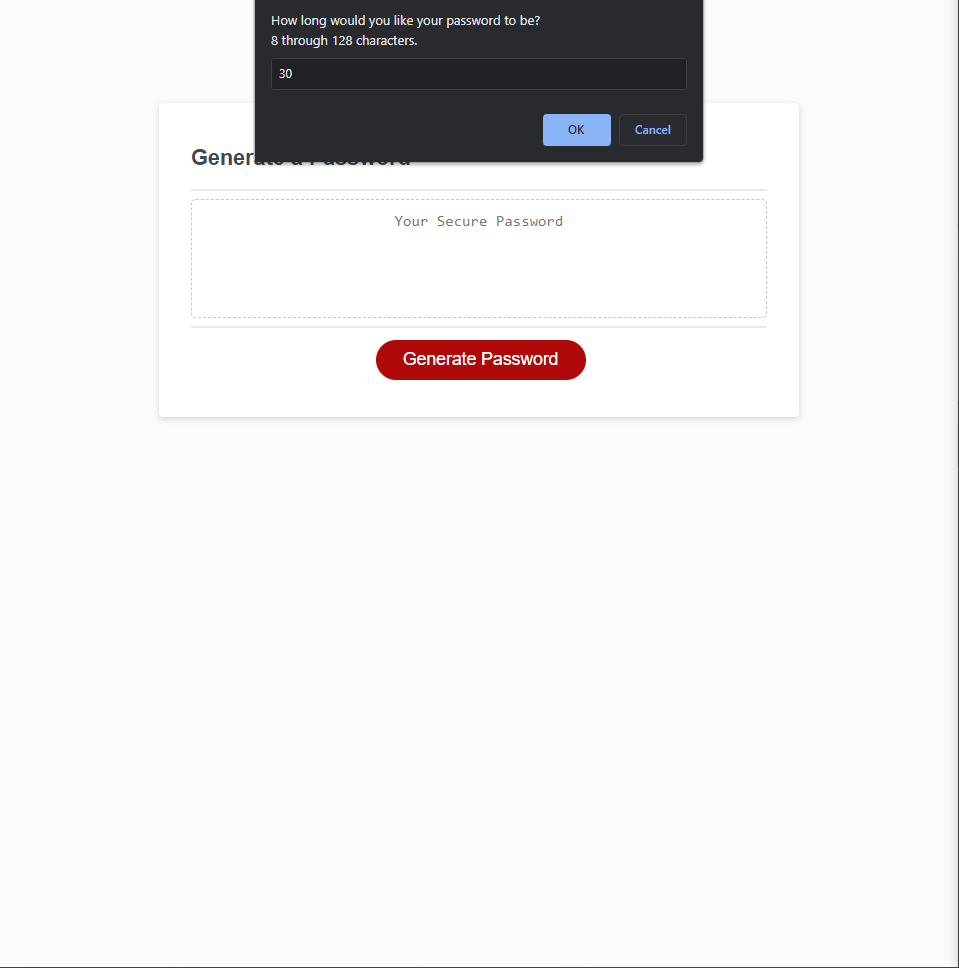
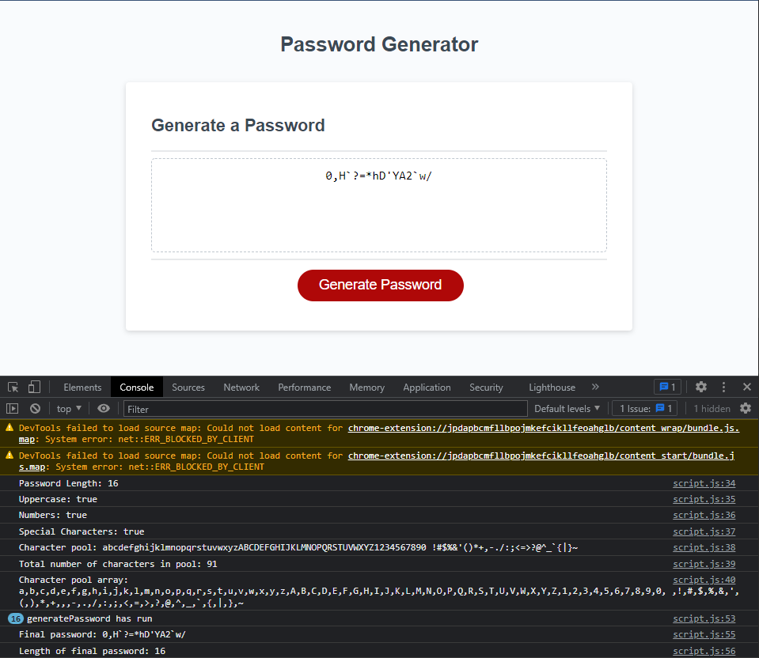

# password-generator

Vincent Yang

## tasks

* Click the Generate Password button to initiate the prompt
* Lower case letters will automatically be added to the password character pool. User will be prompted for whether or not the user would like upper case letters, numbers, and special characters to be added to the password character pool.
* Randomly generated password will be output into the center text box
* All input values and output values are shown in console log.

* https://github.com/vyang14/password-generator
* https://vyang14.github.io/password-generator/

After pressing "Generate Password" button:

After all user input has been submitted:
